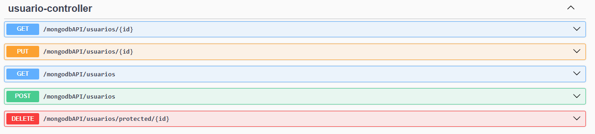

# Portafolio Manager

This is a project built in framework Spring. Includes next dependencies:

- **Databases**:
  - H2
  - Flyway
  - MongoDB
- **Security**:
  - Spring Security
- **Aspects**:
  - AOP (Programación Orientada a Aspectos)
- **Comunicación**:
  - RestTemplate
  - Retryable
- **Monitoring and Doc**:
  - Actuator
  - Swagger
- **Exception Handler**:
  - Global Exception Handler
- **Loggers**:
  - Logger
- **Microservice design pattern**:
  - Circuit Breaker
- **Cache**:
  - Redis

## Naming Conventions for endpoints
It is the order that you need to arrange the methods in the controllers and services, 
to conserve the order and make it easier to find the methods.

- get[Entity]ById ex. getPortfolioById()
- update[Entity]ById ex. updatePortafolioById() 
- delete[Entity]ById ex. deletePortafolioById()
- getAll[Entity] ex. getAllPortafolio()
- save[Entity] ex. savePortafolio()

and this way you will name the methods in the future controllers and services.

## Naming Conventions for instances
- [entity]Instance ex. portafolioRepository

# PortafolioManager running
